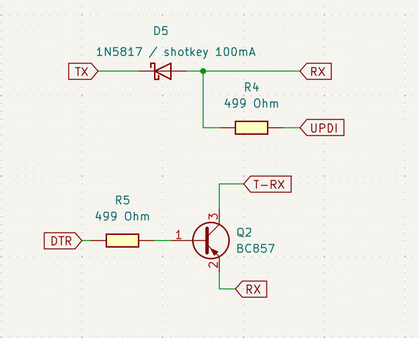
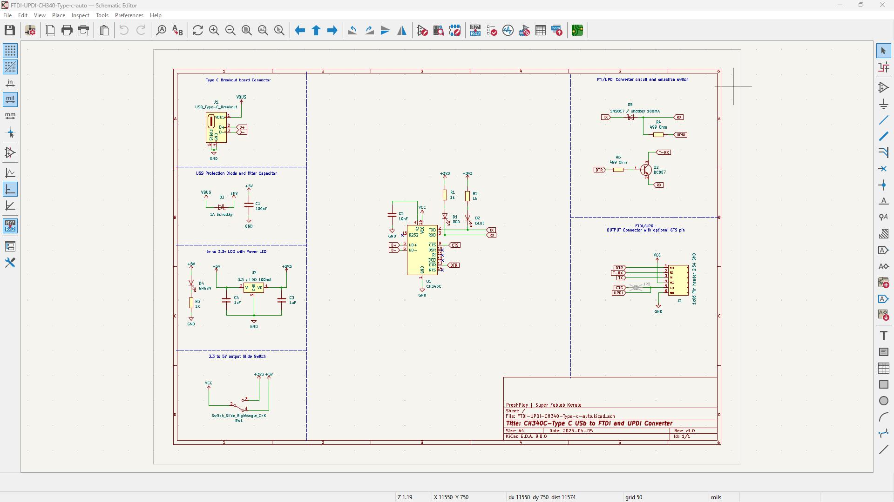
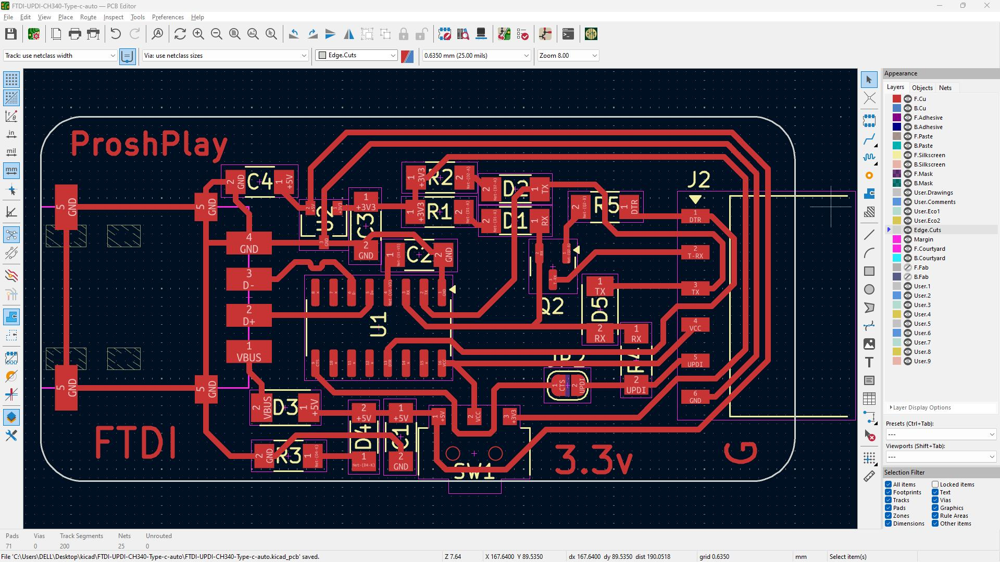
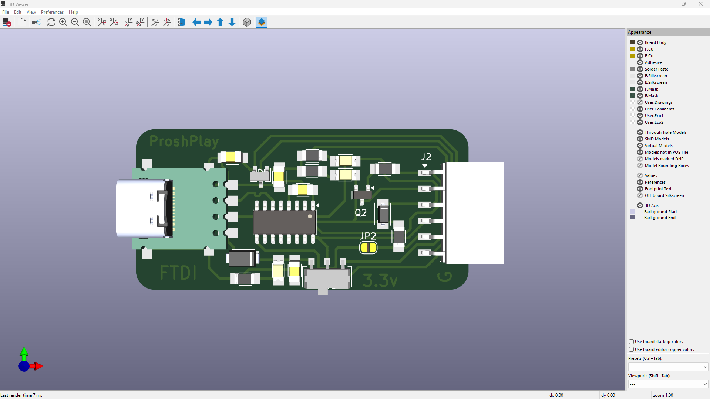

# ProshPlay-Type-C-Ch340C-Auto-UPDI-FTDI-Converter

## Schematic

## PCB Layout

## 3D PCB

## Reference  
- [Arduino Forum Yet another UPDI ro rammer Mk II](https://forum.arduino.cc/t/yet-another-updi-programmer-mk-ii/1357056/2)